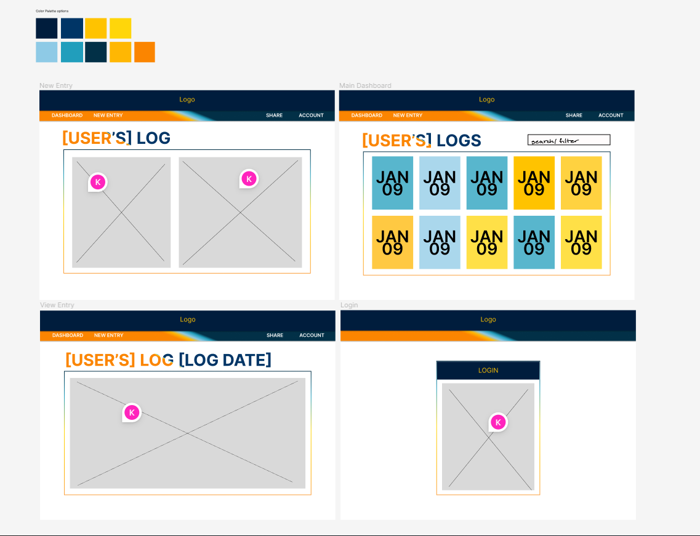

# symptom-tracker
A CRUD web application to track symptoms for people with Chronic Illnesses. Based off of my own analog health tracker!

## Technologies Used
* HTML5
* CSS3
* JavaScript
* Mongoose
* MongoDB
* Node
* Express
* Bootstrap
* jQuery

## Wireframe
[Wireframe]

## Getting Started
[Click Here to see the deployed app!](https://logr-symptom-tracker.herokuapp.com/symptomTracker) To add a new log entry click "New Log" and fill out form details.

## Future Enhancements
* Add User Auth so each user can add their own private logs
* Add share ability
* If user is not logged in, index shows landing page describing app