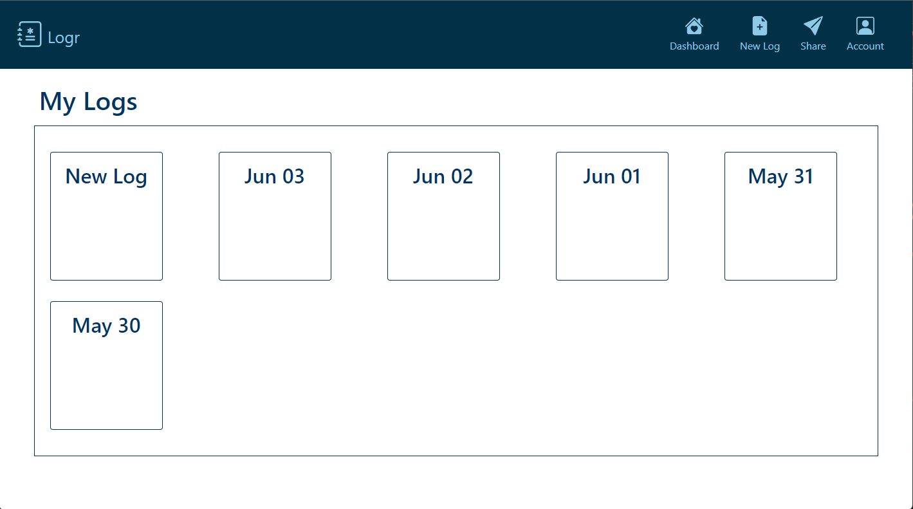
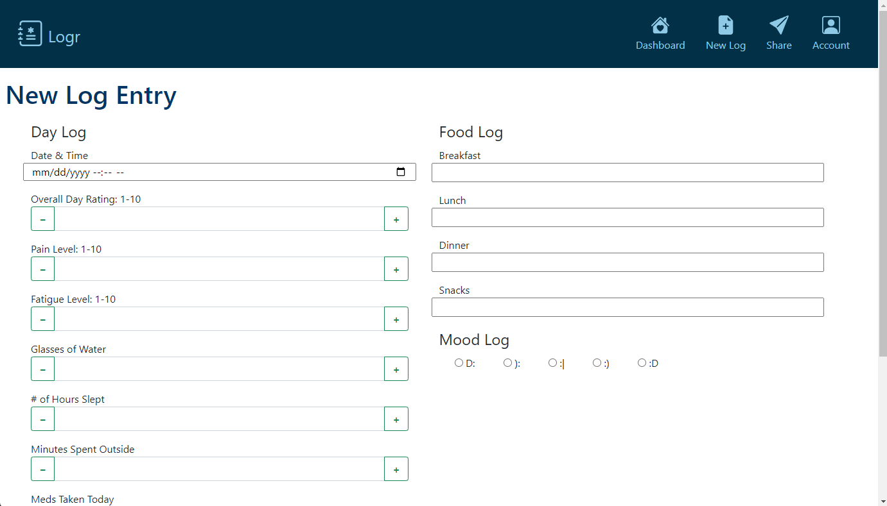
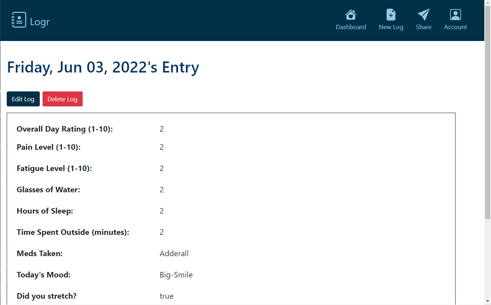
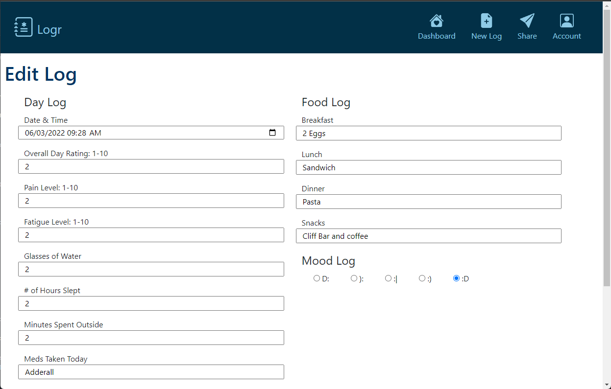

# Logr
A CRUD web application to track symptoms for people with chronic illnesses. Based off of my own analog symptom tracker!

## Logr's Story
I came up with the idea for Logr after I had created a Daily Symptom Log to better track and manage my Fibromyalgia. An issue many people with chronic illnesses have (including myself) is remembering all of the triggers, symptoms, and general chaos each day includes. This makes it harder to manage your symptoms and almost impossible to fully explain them to doctors. Logr is a solution to that!

Logr gives users the ability to track a variety of symptoms by filling out a Daily Log. The Daily Log is designed to be thorough while remaining easy to complete. Logr's UI/UX design prioritizes accessibility and responsiveness with large text and icons for readability, user-friendly form inputs, and a consistent, well-thought out structure. 

## Technologies Used
* HTML5
* CSS3
* JavaScript
* Mongoose
* MongoDB
* Node
* Express
* Bootstrap
* jQuery

## Wireframe

## Planning
### Research
First, I posted in chronic illness forums and talked with my friends that also have chronic illnesses. I got feedback on features users would want and any other expectations. Then, I examined similar apps to identify any commonalities. My research stage also included learning more about creating accessible applications!

### Wireframe

Designed in collaboration with Blu Funk-Wilder

### User Stories
Before starting to code, I created user stories in a [Trello Board](https://trello.com/b/0pU2UzMl/logr-user-stories). These acted as a to-do list as I developed Logr.

## Getting Started
[Click Here to see the deployed app!](https://logr-symptom-tracker.herokuapp.com/) To add a new log entry click "New Log" and fill out form details.

## Current App - V1.0

## Credits
UI/UX Co-Designer - Blu Funk-Wilder - Figma

## Future Enhancements
* Add User Auth so each user can add their own private logs
* Users can share entries
* If user is not logged in, index shows landing page describing app
* Add logo and other custom design elements
* Logged in users can see statistics to identify patterns over time
* Integrate weather API to display users weather automatically for each entry
